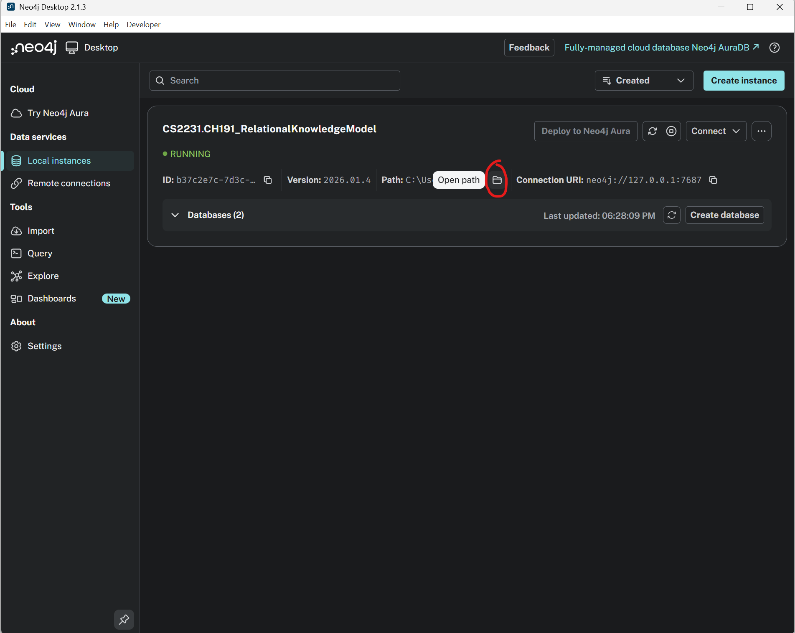

# **Trợ lý Pháp lý Thông minh về Luật Đất đai (2013 & 2024)**

Dự án này là một hệ thống Hỏi-Đáp và So sánh thông minh, được xây dựng nhằm cung cấp các câu trả lời chính xác và có căn cứ về hai phiên bản Luật Đất đai 2013 và 2024 của Việt Nam.

Hệ thống ứng dụng kiến trúc **RAG (Retrieval-Augmented Generation)** nâng cao, kết hợp sức mạnh của **Đồ thị Tri thức (Knowledge Graph - Neo4j)**, **Tìm kiếm Ngữ nghĩa (Semantic Search - FAISS)**, và các **Mô hình Ngôn ngữ Lớn (LLMs)**.

 <!-- Bạn nên chụp một ảnh màn hình đẹp của ứng dụng và đặt link vào đây -->

## **🌟 Tính Năng Chính**

*   **Hỏi-Đáp Tình huống:** Trả lời các câu hỏi phức tạp về quyền và nghĩa vụ sử dụng đất, thủ tục hành chính, chế tài, hạn mức, v.v.
*   **So sánh Luật:** Tự động đối chiếu và phân tích các điểm khác biệt cốt lõi về một chủ đề cụ thể giữa hai phiên bản luật 2013 và 2024.
*   **Trích dẫn Đáng tin cậy:** Mọi câu trả lời đều đi kèm với trích dẫn Điều/Khoản luật cụ thể làm căn cứ, tăng cường tính minh bạch và độ tin cậy.
*   **Truy xuất Thông minh:** Sử dụng pipeline truy xuất hai giai đoạn (two-stage retrieval):
    1.  **Candidate Retrieval:** Dùng Semantic Search (FAISS) để nhanh chóng lọc ra một tập hợp lớn các điều luật có khả năng liên quan.
    2.  **Reranking:** Dùng mô hình Cross-Encoder để sắp xếp lại chính xác tập hợp trên, đảm bảo những điều luật phù hợp nhất được ưu tiên.

## **⚙️ Kiến trúc Hệ thống**

Dự án được chia thành hai luồng chính: **Xây dựng Cơ sở Tri thức (Offline)** và **Xử lý Truy vấn (Online)**.

 <!-- Bạn nên vẽ sơ đồ luồng đã tạo bằng Mermaid và đặt link vào đây -->

1.  **Giao diện người dùng (Streamlit):** Giao diện web tương tác để người dùng nhập câu hỏi.
2.  **Pipeline Truy xuất (Retrieval Pipeline):**
    *   **Semantic Retriever (FAISS + Bi-Encoder):** Thực hiện tìm kiếm ngữ nghĩa trên toàn bộ văn bản luật để lấy ra top-K ứng viên.
    *   **KG Connector (Neo4j):** Lấy nội dung chi tiết của các ứng viên và các thông tin có cấu trúc khác.
    *   **Reranker (Cross-Encoder):** Đánh giá lại và sắp xếp các ứng viên để chọn ra những ngữ cảnh phù hợp nhất.
3.  **Pipeline Sinh câu trả lời (Generation Pipeline):**
    *   **Prompt Engineering:** Xây dựng các prompt chuyên biệt cho tác vụ hỏi-đáp và so sánh, tích hợp kỹ thuật Chain-of-Thought (CoT).
    *   **Generator (LLM):** Sử dụng LLM (ví dụ: Google Gemini) để đọc ngữ cảnh đã được truy xuất và tạo ra câu trả lời cuối cùng.

---

## **🚀 Hướng Dẫn Cài Đặt và Chạy**

Dự án này có hai luồng sử dụng chính:
1.  **Chạy Ứng Dụng (For End-Users):** Dành cho những ai muốn nhanh chóng trải nghiệm ứng dụng với bộ dữ liệu đã được xử lý sẵn.
2.  **Xây Dựng Lại Dữ Liệu (For Developers):** Dành cho các nhà phát triển muốn tự chạy lại toàn bộ pipeline xử lý dữ liệu từ đầu.

Vui lòng làm theo hướng dẫn tương ứng với nhu cầu của bạn.

### **1. Yêu Cầu Chung**

*   **Python:** `3.10` hoặc cao hơn.
*   **Conda:** Đã cài đặt [Anaconda](https://www.anaconda.com/download) hoặc [Miniconda](https://docs.conda.io/en/latest/miniconda.html).
*   **Java:** Đã cài đặt [JDK 17](https://adoptium.net/temurin/releases/) hoặc cao hơn để chạy Neo4j.
*   **Neo4j Desktop:** Đã cài đặt và tạo một cơ sở dữ liệu trống (ví dụ: đặt tên là `neo4j`).
*   **API Key:**
    *   Tạo một file có tên `.env` trong thư mục gốc của project.
    *   Điền **chỉ cần** khóa API của Google Gemini:
        ```env
        # Google Gemini API Key
        GOOGLE_API_KEY="AIzaSy..."

        # Neo4j Credentials (sẽ được dùng bởi các script)
        NEO4J_URI="bolt://localhost:7687"
        NEO4J_USER="neo4j"
        NEO4J_PASSWORD="your_neo4j_password"
        ```

### **2. Cài Đặt Môi Trường**

Mở Terminal (hoặc Anaconda Prompt trên Windows) và thực hiện các lệnh sau:

**a. Tạo và kích hoạt môi trường Conda:**
```bash
conda create -n luatdatdai_env python=3.10 -y
conda activate luatdatdai_env
```

**b. Cài đặt các gói cần thiết:**
```bash
# Cài đặt PyTorch và FAISS (khuyến nghị dùng conda để có phiên bản tối ưu)
conda install pytorch torchvision torchaudio -c pytorch -y
conda install -c conda-forge faiss-cpu -y

# Cài đặt các thư viện còn lại từ requirements.txt
pip install -r requirements.txt
```
*(Lưu ý: Bạn cần tạo file `requirements.txt` từ môi trường đã cài đặt của mình)*

---

## **Part 1: Chạy Ứng Dụng (Dành cho người dùng thông thường)**

Phần này hướng dẫn bạn cách khởi chạy ứng dụng web khi đã có sẵn các file dữ liệu đã được xử lý.

**Bước 1: Nạp Dữ liệu vào Neo4j**
1.  Đảm bảo bạn đã có các file `nodes_final.csv` và `relationships_final.csv` trong thư mục `result_final`.
2.  Mở Neo4j Desktop và **dừng (Stop)** cơ sở dữ liệu `neo4j` của bạn.
3.  Click vào nút `...` bên cạnh CSDL, chọn `Open folder` -> `Import`.
4.  **Xóa toàn bộ nội dung** bên trong thư mục `import` nếu có.
5.  **Sao chép** 2 file `nodes_final.csv` và `relationships_final.csv` từ thư mục `result_final` của dự án vào thư mục `import` bạn vừa mở.
6.  Quay lại Neo4j Desktop, click lại vào `...` -> `Open folder` -> `Terminal`.

6. 1- Không tìm thấy Terminal của Neoj4 thì hãy open folder bằng cách click vào nút như hình


7.  Trong cửa sổ terminal vừa mở, chạy lệnh sau để import dữ liệu:
    ```bash
    neo4j-admin database import full \
      --nodes=nodes_final.csv \
      --relationships=relationships_final.csv \
      --overwrite-destination=true \
      --multiline-fields=true
    ```
    *(Lưu ý: Trên Windows, lệnh có thể là `neo4j-admin.bat database import ...`)*
8.  Sau khi import thành công, quay lại Neo4j Desktop và **khởi động (Start)** lại cơ sở dữ liệu.

**Bước 2: Tạo Full-Text Index**
1.  Mở Neo4j Browser cho cơ sở dữ liệu của bạn. (http://localhost:7474/browser/)
2.  Chạy câu lệnh Cypher sau để tạo index cho việc tìm kiếm từ khóa:
    ```cypher
    CREATE FULLTEXT INDEX lawTextIndex FOR (n:DieuLuat) ON EACH [n.name, n.noi_dung];
    ```
    *(Lưu ý: Lệnh này chỉ cần chạy một lần duy nhất sau khi import dữ liệu).*

**Bước 3: Chạy Ứng dụng Streamlit**
1.  Đảm bảo bạn đã có sẵn các file `faiss_index.bin` và `law_ids.json` trong thư mục gốc.
2.  Trong terminal (vẫn đang ở môi trường `luatdatdai_env`), chạy lệnh:
    ```bash
    streamlit run app.py
    ```3.  Một tab mới sẽ tự động mở trong trình duyệt của bạn. Bây giờ bạn có thể bắt đầu tra cứu và so sánh luật.

---

## **Part 2: Xây Dựng Lại Cơ Sở Tri Thức Từ Đầu (Dành cho nhà phát triển)**

**⚠️ Cảnh báo:** Quá trình này sẽ gọi đến API của LLM nhiều lần và có thể tốn chi phí. Chỉ thực hiện khi bạn muốn tự xây dựng lại toàn bộ dữ liệu từ các file PDF gốc.

**Bước 1: Chuẩn bị file PDF**
*   Đặt 2 file `LuatDatDai2013.pdf` và `LuatDatDai2024.pdf` vào thư mục gốc của dự án.

**Bước 2: Chạy Pipeline Xử lý Dữ liệu**
Chạy các script sau theo đúng thứ tự. Mỗi script thực hiện một giai đoạn trong việc xây dựng cơ sở tri thức.

```bash
# 1. Tiền xử lý PDF và chia thành các file text theo từng Điều luật
python 00_preprocess_pdfs_to_txt.py #Convert pdf to txt file
python 01_preprocess_pdfs.py #Xoá header và format lại txt. Sau đó export ra các file ở chunking folder

# --- BƯỚC THỦ CÔNG ---
# Review lại tất cả các file chunking. Xem đã đủ điều luật chưa. Và điều chỉnh lại cho đầy đủ 
# trước khi chạy các file tiếp theo.

# 2. Dùng LLM để trích xuất thực thể, quan hệ và thông tin so sánh
python 02_extract_entities.py #Export ra các file ở output folder

python 03_extract_comparisons.py #Export ra comparisons_json

# 3. Gộp các file JSON đã trích xuất để chuẩn bị cho việc chuẩn hóa
python 04_0_merge_json.py

# 4. Tạo file CSV để rà soát và xây dựng từ điển đồng nghĩa
python 04a_1_helper_create_synonym_list.py

# --- BƯỚC THỦ CÔNG ---
# Mở file 'entities_for_review.csv', xác định các nhóm thực thể đồng nghĩa
# và cập nhật chúng vào biến `SYNONYM_GROUPS` trong file `04a_2_normalize_and_merge_graph.py`

# 5. Chuẩn hóa và tạo các file CSV trung gian
python 04a_2_normalize_and_merge_graph.py

# 6. Tạo file CSV cho các cạnh so sánh
python 04a_3_process_comparisons.py

# 7. Gộp thành 2 file cuối cùng để import
python 04a_4_finalize_for_import.py

# 8. Kiểm tra tính toàn vẹn của dữ liệu
python 04a_4a_validate_import_files.py

# --- BƯỚC THỦ CÔNG ---
# Nếu bước kiểm tra có data chưa toàn vẹn hoặc lỗi liên kết tới node trống (Sẽ có hướng dẫn khi chạy prompt)
# Hãy kiểm tra, rà soát và fix lại dữ liệu. Sau đó chạy lại quá trình cần thiết.
#  + Nếu chunk thiếu điều luật: Chạy lại 03_extract_comparisons.py, 04_0_merge_json.py, 04a_2_normalize_and_merge_graph.py => 04a_4a_validate_import_files.py
#  + Nếu node chưa chuẩn hóa, hoặc chuẩn hóa sai do LLM extract không chuẩn, hãy fix manual.
# Đảm bảo sau khi fix phải chạy lại và validate lại lần nữa để chắc chắn dữ liệu toàn vẹn. Và bước vào quá trình import
```

**Bước 3 & 4:** Sau khi đã tạo thành công các file `nodes_final.csv`, `relationships_final.csv`, `faiss_index.bin`, và `law_ids.json`, hãy làm theo **Bước 1, 2, 3 của Part 1** để nạp dữ liệu và khởi chạy ứng dụng.